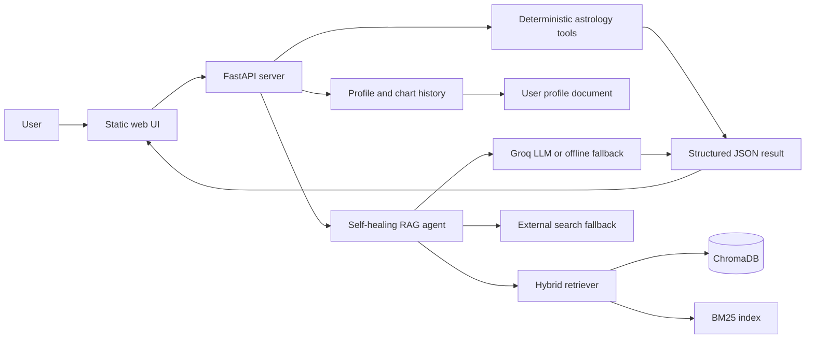

# AstroGuide

AstroGuide is a tool-augmented astrology and numerology assistant that combines deterministic calculations, a browser-based interface, and retrieval-augmented generation (RAG). The system keeps factual computation in Python tools and uses the RAG layer to explain results using indexed astrology knowledge and the user's saved profile and chart history.

> **Academic disclaimer:** AstroGuide is an educational software project. Its interpretations are for reflection and entertainment, not medical, legal, financial, or mental-health advice.

## What the Project Demonstrates

- Deterministic birth-chart calculations using Swiss Ephemeris.
- Numerology, gemstone, and colour recommendations backed by project tables.
- Daily transit interpretation and auspicious-date search.
- Ashtakoota/Guna Milan compatibility scoring.
- A hybrid RAG pipeline combining dense retrieval, BM25, reciprocal-rank fusion, MMR diversification, reranking, and response synthesis.
- A self-healing CRAG policy that can choose direct generation, query rewriting, or external search fallback.
- Persistent profile information and generated chart history that are re-indexed as a user-specific RAG document.
- A FastAPI backend and responsive static web UI with structured JSON responses and graceful error handling.

## Live Application

The application is served locally at:

```text
http://127.0.0.1:8000
```

The interface includes these workflows:

1. **Birth Chart** - calculates a sidereal chart and renders the generated SVG.
2. **Numbers & Stones** - returns numerological indicators and mapped recommendations.
3. **Find Dates** - evaluates candidate dates using the project's astrological rules.
4. **Daily Transits** - computes transit guidance against a natal Moon reference.
5. **Compatibility** - calculates the Ashtakoota compatibility breakdown.
6. **My Profile** - stores user details, notes, and the latest 20 generated results.
7. **Ask AstroGuide** - answers questions using indexed domain knowledge and saved user context.

## Architecture



### Request flow

1. The UI submits JSON to a typed FastAPI endpoint.
2. The selected deterministic tool validates inputs and calculates structured facts.
3. Successful tool results are archived in `data/user_profile.json`.
4. The profile document is refreshed in the RAG collection when profile data changes.
5. A RAG question is embedded and retrieved using semantic and lexical search.
6. The agent selects a corrective action using LinUCB, synthesizes a grounded answer, and returns source metadata to the UI.

### RAG pipeline

The implementation in `astroguide/rag/pipeline/` uses:

- `sentence-transformers/all-MiniLM-L6-v2` for 384-dimensional embeddings.
- BM25 lexical retrieval for exact domain terms.
- Reciprocal Rank Fusion to combine semantic and lexical rankings.
- MMR to reduce redundant context.
- An optional cross-encoder reranker.
- Parent-child chunking so retrieval can return a larger explanatory section.
- LinUCB action selection across direct generation, query rewrite, and external search.
- Groq when `GROQ_API_KEY` is configured, with an offline response fallback otherwise.

## API Surface

| Method | Endpoint | Purpose |
| --- | --- | --- |
| `GET` | `/health` | Service health check. |
| `POST` | `/api/birth_chart` | Generate a birth chart. |
| `POST` | `/api/numbers_stones` | Calculate numerology and recommendations. |
| `POST` | `/api/find_dates` | Find dates using the date-selection rules. |
| `POST` | `/api/daily_transits` | Calculate daily transit guidance. |
| `POST` | `/api/compatibility` | Calculate compatibility scoring. |
| `GET` | `/api/profile` | Read the saved profile and chart history. |
| `PUT` | `/api/profile` | Update profile details and notes. |
| `POST` | `/api/profile/charts` | Save a generated tool result. |
| `POST` | `/api/rag` | Ask a grounded question over indexed knowledge. |

All tool endpoints return a consistent shape:

```json
{
  "success": true,
  "data": {}
}
```

Failures return `success: false` and an explanatory `error` field.

## Installation and Usage

### 1. Create or activate the virtual environment

PowerShell on Windows:

```powershell
python -m venv .venv
& ".\\.venv\\Scripts\\Activate.ps1"
```

### 2. Install dependencies

```powershell
python -m pip install -r AstroGuide\\requirements.txt
```

### 3. Optional: configure Groq

Create a `.env` file in `AstroGuide/` if LLM-powered synthesis and query rewriting are desired:

```text
GROQ_API_KEY=your_key_here
```

The application still provides an offline fallback when the key is absent or the API is unavailable.

### 4. Start the server

```powershell
Set-Location AstroGuide
python -m uvicorn server:app --host 127.0.0.1 --port 8000
```

Then open `http://127.0.0.1:8000` in a browser.

The first RAG request may download the embedding and reranker models. Subsequent requests reuse the local models and persistent Chroma collection.

## Project Layout

```text
AstroGuide/
|-- server.py                         FastAPI application and API routes
|-- main.py                           Standalone CRAG demonstration
|-- astroguide/tools/                 Deterministic astrology tools
|-- astroguide/rag/pipeline/          Ingestion, retrieval, policy, and synthesis
|-- data/tables/                      Astrology and numerology lookup tables
|-- data/user_profile.json            Local profile and generated-result history
|-- static/index.html                 Web interface markup
|-- static/script.js                  Form submission and result rendering
|-- static/style.css                  Interface styling
|-- tests/                             Regression and behavioral tests
|-- TECHNICAL_REPORT.md                Detailed engineering report
`-- requirements.txt                   Python dependencies
```

## Testing

Run the repository verification runner after installing dependencies:

```powershell
python AstroGuide\\test_reproduction.py
```

The tests cover standalone imports, API error wrapping, input boundaries, compatibility scoring, numerology data, SVG retrograde markers, and dependency declarations. A focused server check is also useful:

```powershell
python -c "import sys; sys.path.insert(0, 'AstroGuide'); import server; print(server.health_check())"
```

## Privacy and Responsible Use

Profile details and generated results are stored locally in `data/user_profile.json` and are included in the user-specific RAG document. Do not commit personal profile data or API keys. The application should be extended with authentication, encryption, retention controls, and per-user storage before deployment beyond a local academic demonstration.

## Technical Documentation

See [TECHNICAL_REPORT.md](TECHNICAL_REPORT.md) for the problem definition, design rationale, implementation details, evaluation approach, limitations, and future work.
