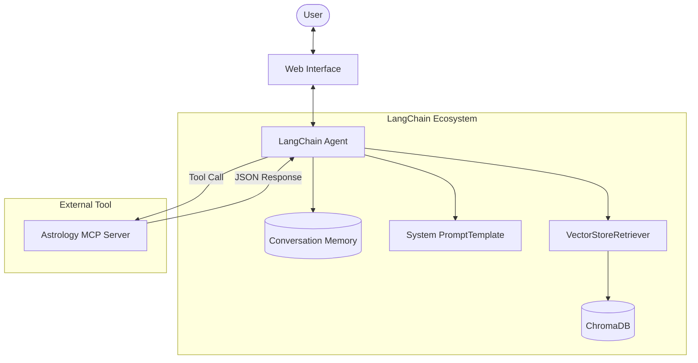

# AstroGuide

AstroGuide is an intelligent, tool-augmented LangChain application that serves as a personalized astrology assistant. It combines deterministic astronomical calculations with an LLM's natural language capabilities and Retrieval-Augmented Generation (RAG).

## Features
- **Accurate Astronomical Calculations:** Uses an external Astrology Model Context Protocol (MCP) tool to fetch real-time planetary data and birth charts.
- **Contextual Knowledge Retrieval:** Uses a Vector Database (ChromaDB) to retrieve astrological rules, remedies, and interpretations.
- **Conversational Memory:** Remembers user details across the session.
- **Robust Error Handling:** Systematically handles missing parameters by re-prompting the user.

## Architecture & LangChain Components

The application leverages 5 core LangChain components:
1. **Agent/Tool:** A ReAct agent bound to the Astrology MCP server.
2. **VectorStoreRetriever:** Connects to ChromaDB to retrieve embeddings from `astrological_remedies.json` and `zodiac_signs.md`.
3. **Memory:** `ConversationBufferMemory` to maintain context.
4. **PromptTemplate:** Guides the agent to behave like an expert astrologer.
5. **OutputParser:** Ensures structured formatting for charts and compatibility scores.

## Sample Input / Output
**Input:** "What is my sun sign if I was born on October 26, 2001, at 10:30 AM in Mumbai?"

**Output:** 
> "Based on the exact astronomical calculations for your birth details, your Sun is located in the sign of Libra (Tula). The Sun in Libra signifies a strong focus on balance, relationships, and diplomacy. Would you like to know the positions of your other planets?"

## Setup Instructions
1. Install requirements: `pip install -r requirements.txt`
2. Start the local MCP server (ensure the astrology MCP is active).
3. Run the application: `python server.py` (or `python main.py`)
4. Access the web UI at `http://localhost:5000`
