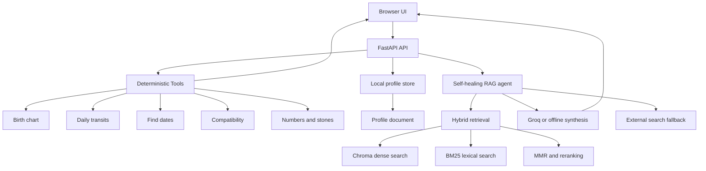

# AstroGuide Technical Report

## Abstract

AstroGuide is a web-based, tool-augmented astrology and numerology assistant developed as an academic software engineering project. It combines deterministic domain computation with retrieval-augmented generation (RAG). Deterministic Python tools calculate charts, transits, compatibility scores, auspicious dates, and numerological recommendations. The RAG subsystem retrieves relevant domain knowledge and saved user context before producing a natural-language explanation.

The main engineering objective is to separate factual calculation from language generation. This makes the output easier to test: numerical and astronomical values are produced by code, while the language layer explains those values using retrieved context. The system also demonstrates corrective retrieval behavior through a contextual bandit that chooses among direct generation, query rewriting, and external search fallback.

## 1. Problem Definition

Many astrology applications provide generic text without exposing how a result was calculated or how it relates to a user's own data. This creates three practical problems:

1. Users need multiple independent tools for related tasks such as birth charts, transits, compatibility, and numerology.
2. Natural-language explanations can become disconnected from deterministic results or indexed reference material.
3. A user's generated charts and notes are often lost between interactions, making follow-up questions less useful.

AstroGuide addresses these problems with a single local web application. It exposes specialized calculation tools through a common API, stores user profile information and generated results locally, and makes that context available to a hybrid RAG pipeline.

## 2. Objectives and Scope

### Objectives

- Provide a usable browser interface for the core astrology workflows.
- Keep astronomical and numerological calculations deterministic and testable.
- Retrieve both domain knowledge and user-specific saved context.
- Return structured API responses that the UI can render consistently.
- Handle invalid input without crashing the server.
- Provide an offline fallback when an LLM API key is unavailable.
- Demonstrate a corrective RAG policy rather than a single fixed retrieval path.

### Scope

The current implementation is a local academic demonstration. It supports one local profile file, a persistent Chroma collection, and a single FastAPI process. It does not yet provide authentication, multi-user isolation, encrypted profile storage, production deployment configuration, or a formal clinical/financial advisory system.

## 3. System Overview



The production web path begins in `server.py`. The static client is composed of `static/index.html`, `static/script.js`, and `static/style.css`. Deterministic tools live under `astroguide/tools/`. The CRAG implementation lives under `astroguide/rag/pipeline/`.

`main.py` is a separate command-line demonstration of the pipeline. It ingests a small native Docling-style sample document and exercises all three CRAG actions. The web server instead seeds an astrology knowledge document and dynamically indexes the user's profile document.

## 4. Functional Components

### 4.1 Birth chart tool

The birth chart endpoint accepts birth date, birth time, latitude, longitude, timezone offset, chart style, and ayanamsha. The calculation layer uses `pyswisseph` and returns structured planetary and chart data, including an SVG representation for the browser.

### 4.2 Daily transit tool

The daily transit workflow accepts a natal Moon sign, an optional natal Moon degree, and a target date. It evaluates transit rules programmatically and returns structured guidance rather than asking an LLM to calculate planetary positions.

### 4.3 Auspicious-date tool

The date search accepts natal Moon information, a date range, location, and timezone. It evaluates the project's date-selection rules and returns candidate dates with explanations and a constructive action field where applicable.

### 4.4 Compatibility tool

The compatibility workflow compares two nakshatra and pada combinations using an Ashtakoota/Guna Milan model. The result includes individual kootas and a total score out of 36. Input bounds are validated at the API layer and domain-level validation is retained inside the tool.

### 4.5 Numbers and stones tool

This workflow calculates numerological values from a birth date and maps the results to project lookup tables for numbers, colours, and gemstones. The lookup data is stored in `data/tables/` rather than generated by the language model.

### 4.6 Profile and chart history

The profile view stores:

- Display name.
- Birth date and time.
- Birth location.
- User-authored notes.
- The latest 20 successful tool results.

The data is written to `data/user_profile.json`. After a profile update or chart save, the RAG profile document is rebuilt and inserted into Chroma under the stable document id `astroguide_user_profile`.

### 4.7 RAG question answering

The Ask AstroGuide view sends a natural-language query to `/api/rag`. The response includes the answer, selected action, rewritten query when applicable, retrieved documents, external search results, and retrieval metrics. The UI presents the answer and makes retrieved sources expandable for inspection.

## 5. RAG and CRAG Design

### 5.1 Ingestion

`DoclingJSONIngestor` accepts native Docling-style dictionaries, files, or raw text. It normalizes text nodes, table nodes, and picture nodes into searchable chunks. For a document, it stores:

- Searchable text in Chroma.
- Structured metadata such as document id, node reference, label, and section title.
- A serialized JSON payload for downstream context reconstruction.
- JSONL output for inspection and reproducibility.

The server indexes two logical documents:

1. `astroguide_core_knowledge`, containing the built-in domain guidance.
2. `astroguide_user_profile`, containing the current profile, notes, and saved chart summaries.

### 5.2 Parent-child chunking

The chunker creates fine-grained child chunks for retrieval while retaining a larger parent section for synthesis. This prevents the retriever from returning only a sentence fragment when the answer needs surrounding context. The configured soft parent limit is 900 characters.

### 5.3 Hybrid retrieval

The retriever executes two searches:

- Dense semantic search using the sentence-transformers embedding model and Chroma cosine distance.
- Sparse lexical search using BM25.

The two ranked lists are merged with Reciprocal Rank Fusion. For a document `d`, the conceptual fusion score is:

```text
RRF(d) = w_sem / (k + semantic_rank(d)) + w_bm25 / (k + bm25_rank(d))
```

where `w_sem` and `w_bm25` are semantic and BM25 weights and `k` is the rank constant. The fused candidates are diversified using Maximal Marginal Relevance (MMR), then optionally reranked with a cross-encoder.

### 5.4 State vector and action policy

The retriever creates a state vector containing:

- A 384-dimensional query embedding.
- The average reranking score.
- The maximum reranking score.

The resulting state has dimension 386. The LinUCB policy chooses one of three actions:

| Action | Name | Behavior |
| --- | --- | --- |
| 0 | Direct generation | Synthesize from the initial retrieved context. |
| 1 | Query rewrite | Expand the query, retrieve again, and merge results. |
| 2 | External search | Query the external search tool and include formatted results. |

After synthesis, an LLM-as-a-judge step estimates response quality. The policy receives a net reward after an action-dependent cost penalty, allowing future selections to adapt to observed outcomes.

### 5.5 Offline behavior

When `GROQ_API_KEY` is absent or a Groq request fails, the agent uses a deterministic fallback. The fallback extracts retrieved document blocks and formats them into a grounded answer. This keeps the local demonstration usable without requiring a hosted model, although it is less expressive than LLM synthesis.

## 6. API Design

The API is implemented with FastAPI and Pydantic request models. Tool errors are returned as JSON rather than uncaught exceptions so the browser can show a useful message.

| Method | Endpoint | Request | Response |
| --- | --- | --- | --- |
| `GET` | `/health` | None | Service status and version. |
| `POST` | `/api/birth_chart` | Birth details and chart options. | Chart data or error. |
| `POST` | `/api/numbers_stones` | Birth date. | Numerology and recommendations. |
| `POST` | `/api/find_dates` | Moon data, date range, and location. | Candidate dates or error. |
| `POST` | `/api/daily_transits` | Moon data and target date. | Transit data or error. |
| `POST` | `/api/compatibility` | Two nakshatra/pada pairs. | Koota breakdown or error. |
| `GET` | `/api/profile` | None | Local profile and chart history. |
| `PUT` | `/api/profile` | Profile fields and notes. | Updated profile. |
| `POST` | `/api/profile/charts` | Tool name and structured result. | Updated profile. |
| `POST` | `/api/rag` | Query and optional forced action. | Grounded response and retrieval metadata. |

The server uses lazy RAG initialization. The deterministic tool endpoints can load without initializing embedding models; the embedding and Chroma stack is initialized when the first RAG request is made.

## 7. Data Storage

| Data | Location | Purpose |
| --- | --- | --- |
| Lookup tables | `data/tables/*.json` | Deterministic astrology and numerology rules. |
| User profile | `data/user_profile.json` | Local profile, notes, and latest 20 results. |
| Chroma database | User cache under `.cache/crag_chroma_db` | Persistent embeddings and metadata. |
| JSONL artifacts | `astroguide/output/jsonl/` | Inspectable ingested chunk records. |
| Parent artifacts | `astroguide/output/parents/` | Parent-section context records. |

The profile file is intentionally local for the academic demonstration. It should not be committed when it contains real personal information.

## 8. Quality and Testing Strategy

The repository contains a regression runner in `test_reproduction.py` and tests under `tests/`. Current checks include:

- Standalone tool importability.
- API error wrapping.
- Boundary validation for signs and nakshatras.
- Compatibility scoring edge cases.
- Numerology friendly-number behavior and deduplication.
- SVG retrograde indicators.
- Dependency declarations.
- Static UI error handling.

Recommended validation commands are:

```powershell
python AstroGuide\test_reproduction.py
python -m py_compile AstroGuide\server.py AstroGuide\main.py
```

A complete evaluation should additionally measure retrieval precision, groundedness, answer completeness, latency, and the reward distribution across the three CRAG actions. Those measurements are not yet formal benchmark results and should be collected using a fixed query set before making performance claims.

## 9. Security, Privacy, and Ethics

The current project is intended for local educational use. Important considerations are:

- User profile data is stored in plaintext locally.
- No authentication or authorization layer is present.
- External search may send the user's query outside the local process.
- A Groq API key must be stored outside source control.
- Astrology, numerology, and gemstone suggestions must not be presented as professional medical, legal, financial, or mental-health advice.
- Production deployment would require user isolation, encryption, retention and deletion controls, audit logging, and explicit consent for external search or hosted LLM processing.

## 10. Limitations

1. The current profile store supports one local profile rather than multiple authenticated users.
2. The core knowledge seed is intentionally small; a production-quality knowledge base requires curated, licensed source material and provenance metadata.
3. The fallback generator is extractive and cannot match a full language model's reasoning or style.
4. RAG quality depends on the embedding and reranker models being available and correctly cached.
5. External search results can vary over time and require source-quality checks.
6. Astrology interpretations are culturally and methodologically variable; the software cannot establish scientific validity for interpretive claims.
7. The current test suite is primarily regression-focused and does not yet provide a statistically significant retrieval or answer-quality benchmark.

## 11. Future Work

- Add authentication and per-user profile storage.
- Add document upload with explicit source provenance and deletion controls.
- Add a formal RAG evaluation set with recall, precision, groundedness, and latency metrics.
- Add request tracing and policy telemetry dashboards.
- Add rate limiting, structured logging, and production deployment configuration.
- Improve citation rendering so answers link directly to source documents and chunk references.
- Add a review workflow for domain experts to approve or reject indexed knowledge.
- Expand automated tests around profile persistence, RAG indexing refresh, and concurrent requests.

## 12. Conclusion

AstroGuide demonstrates how deterministic domain tools and generative language systems can be combined without asking the language model to perform the underlying calculations. Its strongest design decision is the separation between computation, retrieval, and narration. The profile and chart-history feature extends that separation into a personalized workflow: user-generated results become structured local data, that data becomes retrievable context, and the RAG layer can explain future questions using the user's own history.
