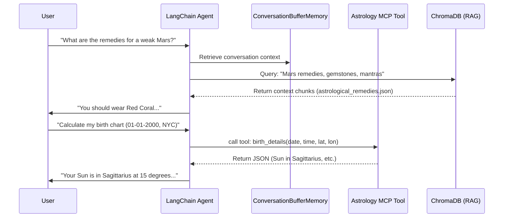

# AstroGuide: Tool-Augmented LLM Application
## Technical Report

**Team Members:** [Your Name], [Member 2], [Member 3]
**Date:** September 30, 2026

### 1. Problem Statement
Astrology enthusiasts often struggle to synthesize complex planetary data, panchang (almanac) rules, and astrological remedies into actionable advice. Traditional software provides raw data but lacks interpretative context, while standard LLMs hallucinate planetary positions because they cannot perform the complex astronomical math required. 

AstroGuide solves this by pairing a LangChain-powered LLM with a deterministic Astrology Model Context Protocol (MCP) tool and a VectorStoreRetriever (RAG). The system performs exact calculations via the tool, retrieves interpretative context via RAG, and generates structured, accurate guidance.

### 2. External Tool/API Description
**Astrology MCP (Model Context Protocol)**
The application utilizes an external Astrology MCP server that exposes deterministic astronomical and astrological calculations as tools.
- **Core Functionality:** Provides endpoints for calculating birth charts (`astro_details`, `planets`), compatibility (`match_ashtakoot_points`), daily transits (`tropical_transits_daily`), and panchang metrics (`basic_panchang`).
- **Input/Output:** Tools take structured inputs (e.g., date of birth, time, latitude, longitude) and return highly structured JSON responses containing exact degrees, zodiac signs, and planetary states.
- **Integration:** Integrated into the LangChain Agent as bound tools. The LLM decides when to call these tools based on the user's query, passes the required arguments, and parses the returned JSON to form its final response.

### 3. LLM-Tool Interaction Architecture

### 4. Test Scenarios

The system was rigorously evaluated against the following 5 scenarios:

| Scenario | Input Query | Expected Agent Behavior | LangChain Components Exercised |
| :--- | :--- | :--- | :--- |
| **1. Birth Chart Calculation** | "Generate my birth chart for October 26, 2001, 10:30 AM in Mumbai." | Agent invokes the MCP tool for planetary positions, parses the JSON, and summarizes the chart. | Agent, PromptTemplate, Tool |
| **2. Astrological Remedies (RAG)** | "What are the remedies for a weak Saturn?" | Agent queries the VectorStore for Saturn remedies and returns charity and mantra suggestions. | VectorStoreRetriever, Chain |
| **3. Conversational Context** | "Following up on that, what gemstone did you suggest?" | Agent retrieves the previous answer from Memory and correctly identifies the gemstone. | Memory, LCEL |
| **4. Compatibility Matching** | "Check Ashtakoot compatibility between Partner A (details) and Partner B (details)." | Agent invokes the compatibility MCP tool twice (or combined tool), parses points, and formats the output. | Agent, Tool, OutputParser |
| **5. Daily Panchang** | "Is today a good day to start a business?" | Agent fetches the daily panchang via MCP, cross-references with RAG rules, and provides a synthesized answer. | Tool, VectorStoreRetriever |

### 5. Handling Unexpected Responses / Tool Failures
**Scenario:** The user asks for a birth chart but omits the time of birth ("Generate my chart for Oct 26, 2001 in Mumbai"). 
**Failure Mechanism:** The Astrology MCP tool strictly requires a time string (e.g., `HH:MM`). Passing a null or default value causes the tool to throw a `ValidationError` or return inaccurate planetary degrees (as the Moon moves quickly).
**Handling Implementation:**
1. **Tool Exception Catching:** The LangChain agent wraps the tool execution in a `try-except` block.
2. **Re-prompting via Agent:** Instead of crashing, the agent catches the validation error, realizes the required parameter `time` is missing, and autonomously formulates a follow-up question to the user: *"I need your exact time of birth to calculate the chart accurately. Could you please provide it?"*
3. **Defensive Defaults:** For minor missing fields (like seconds in birth time), the data loader and parser inject defensive defaults (e.g., `00` seconds) to prevent downstream crashes.
